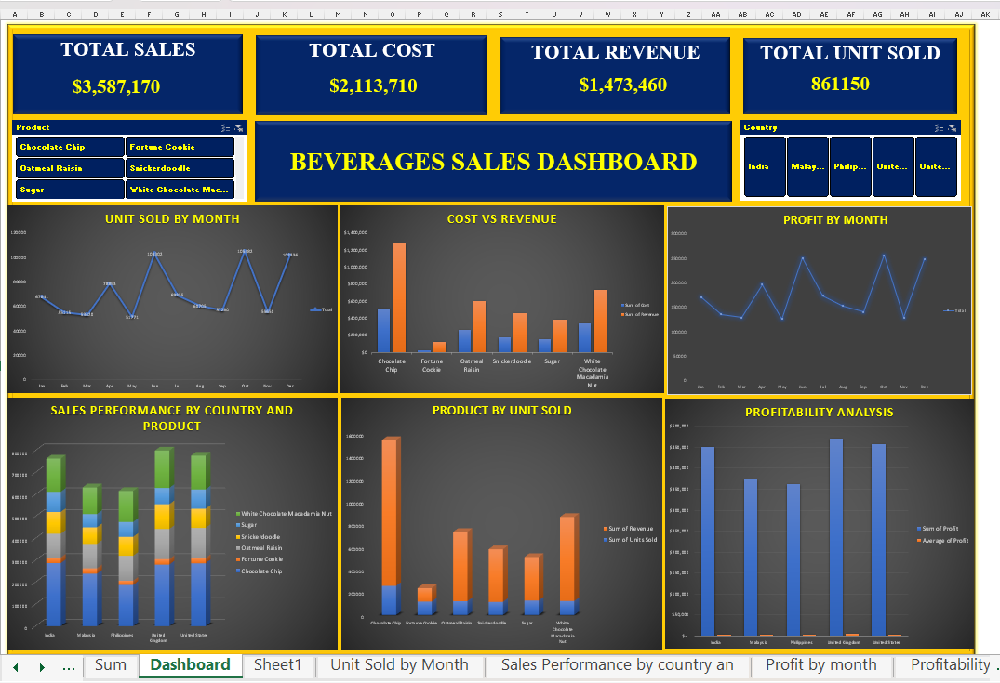

# Beverages-Sales-Dashboard

This project focuses on analyzing sales data for various beverage products across countries, including India, Malaysia, the Philippines, the United Kingdom, and the United States. The dashboard was built in Excel with advanced features, including interactive slicers for product and country, as well as multiple KPIs to monitor overall sales performance.
## Project Summary
The Beverages Sales Dashboard is an interactive Excel-based dashboard designed to provide business stakeholders with clear insights into sales performance, profitability, cost vs revenue trends, and product distribution across multiple countries. The dashboard utilizes slicers, KPIs, and dynamic visualizations to facilitate quick decision-making.
### ✨Key Features
#### KPIs Include:
- Total Sales
- Total Cost
- Total Revenue
- Total Units Sold
### Interactive Slicers:
- Filter data by Product and Country
### 📊Visualizations:
- 📈 Unit Sold by Month – Tracks monthly sales volume
- 📊 Cost vs Revenue – Compares production cost with sales revenue
- 📉 Profit by Month – Shows profitability trends over time
- 🌍 Sales Performance by Country and Product – Visualizes market distribution
- 🥇 Product by Unit Sold – Identifies top-selling products
- 💹 Profitability Analysis – Evaluates profit contribution per country
### 📂 Dataset Overview
#### The dataset includes key information such as:
- Product Category
- Sales Revenue
- Total Cost
- Units Sold
- Country
- Monthly Sales Data
## This dataset was cleaned and structured in Excel for effective visualization.
  **Cleaned Data**
   
   [Downloadhere](Beverages_Cleanddata.xlsx)
## 📷 Dashboard Preview
#### Below is a snapshot of the interactive Beverages Sales Dashboard.
The dashboard highlights key metrics such as total sales, revenue trends, top-performing products, customer distribution, and regional performance.
It serves as a one-stop view for analyzing sales performance and identifying growth opportunities.

To interact with the dashboard, click [Downloadhere](Beverages_Dashboard1.xlxs)
## 🔑 Insights Generated
- Chocolate Chip emerged as the best-performing product, driving the highest revenue and units sold.
- Certain countries (e.g., India and the United Kingdom) contributed significantly to overall profitability.
- Clear seasonality patterns were observed in monthly unit sales and profit trends.
- Profit margins vary across product categories, highlighting areas for potential cost optimization.
## 🛠 Tools & Techniques Used
- Microsoft Excel (Data Cleaning, Pivot Tables, Dashboard Design)
- Formulas & Functions: SUM, AVERAGE, Percentage Calculations
- Data Visualization: Column Charts, Line Charts, Combo Charts
- Interactivity: Slicers for Product & Country filtering
## 📌 Recommendations
- Strengthen Regional Sales – Focus marketing and distribution efforts on underperforming regions to balance sales growth across all markets.
- Maximize High-Performing Products – Increase inventory and promotions for top-selling beverages to sustain momentum and drive higher revenue.
- Revitalize Low-Selling Products – Introduce discounts, new packaging, or seasonal campaigns to stimulate demand for slow-moving items.
- Leverage Seasonal Trends – Align production and promotions with peak sales months to capture maximum customer demand.
- Target Key Customer Segments – Develop tailored campaigns and loyalty programs for top-buying age and gender groups to enhance repeat purchases.

## 👨‍💻 Author
Folagbade Olatunbosun Samuel
- 🎓 Data Analyst | Business Development Specialist
- 📊 Skilled in Excel, Power BI, SQL, and Data Visualization
- 🌍 Passionate about transforming raw data into actionable insights
### 🔗 Connect with me:
- LinkedIn:https://www.linkedin.com/in/olatunbosun-folagbade-559151243/
- Email: Folagbadeolatunbosun@gmail.com

   
   

