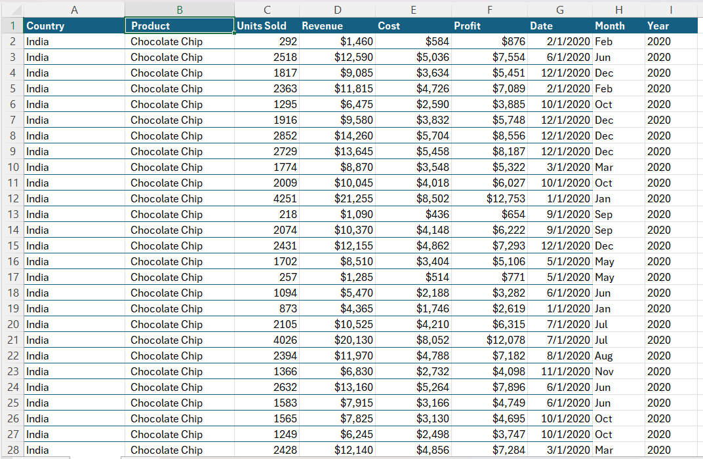

# Beverages-Sales-Dashboard
This project focuses on analyzing sales data for various beverage products across countries, including India, Malaysia, the Philippines, the United Kingdom, and the United States. The dashboard was built in Excel with advanced features, including interactive slicers for product and country, as well as multiple KPIs to monitor overall sales performance.
## Project Summary
The Beverages Sales Dashboard is an interactive Excel-based dashboard designed to provide business stakeholders with clear insights into sales performance, profitability, cost vs revenue trends, and product distribution across multiple countries. The dashboard utilizes slicers, KPIs, and dynamic visualizations to facilitate quick decision-making.
### Key Features
#### KPIs Include:
- Total Sales
- Total Cost
- Total Revenue
- Total Units Sold
### Interactive Slicers:
- Filter data by Product and Country
### Visualizations:
- 📈 Unit Sold by Month – Tracks monthly sales volume
- 📊 Cost vs Revenue – Compares production cost with sales revenue
- 📉 Profit by Month – Shows profitability trends over time
- 🌍 Sales Performance by Country and Product – Visualizes market distribution
- 🥇 Product by Unit Sold – Identifies top-selling products
- 💹 Profitability Analysis – Evaluates profit contribution per country
### 📂 Dataset Overview
#### The dataset includes key information such as:
- Product Category
- Sales Revenue
- Total Cost
- Units Sold
- Country
- Monthly Sales Data
## This dataset was cleaned and structured in Excel for effective visualization.
  **Cleaned Data**
 :.......................:
   
   [Downloadhere](Beverages_cleandata.xlsx)
   

